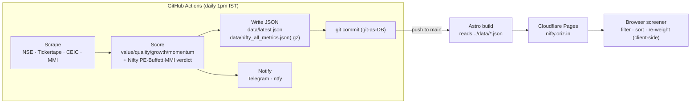

# oriz-nifty-signal

**Client-side stock screener for the Indian market — is now a good time to buy Indian equity?**

[](LICENSE)
[](https://github.com/chirag127/oriz-nifty-signal/stargazers)
[](https://github.com/chirag127/oriz-nifty-signal/commits)
[](https://www.python.org/)
[](https://astro.build/)
[](https://github.com/chirag127/oriz-nifty-signal/actions/workflows/ci.yml)

A daily valuation-timing signal **and** a backend-free stock screener over the whole
Indian listed universe (~5,000 NSE/BSE names). A Python job scrapes keyless sources
once a day, scores every stock for cheapness/quality/growth/momentum, and commits one
compact JSON. An Astro + Preact site then filters, sorts, and re-weights that JSON
entirely in your browser — no server, no login, no data leaving your device.

- **Live site:** https://nifty.oriz.in
- **GH Pages landing:** https://chirag127.github.io/oriz-nifty-signal/
- **Repo:** https://github.com/chirag127/oriz-nifty-signal

⭐ If this is useful, please **star the repo** — it helps others find it.

## Data flow



## Features

- **Buy/hold verdict** — Nifty 50 PE (40%), Nifty 500 PE (15%), Buffett indicator
  (25%), Market Mood Index (20%) → composite score → STRONG BUY / ACCUMULATE /
  HOLD-SIP-ONLY / CAUTION. A failed source is recorded `n/a`, never fabricated.
- **Full-universe screener** — one row per stock with valuation, quality, growth,
  health, ownership, momentum/risk, and MTF-eligibility fields; filter builder,
  sortable columns, custom-weight sliders, one-tap presets (Deep Value, Quality
  Value, Magic Formula, Piotroski, GARP, MTF Buy-and-Hold).
- **Percentile VALUE composite** — equal-weight percentile ranks of five cheapness
  yields (E/P, B/P, S/P, EBITDA/EV, FCF-yield); per-factor z-scores stored so the
  browser re-ranks without refetching. Div-yield stored but kept out of core (tax drag).
- **Preset-backing math** — Graham defensive, Greenblatt Magic Formula rank,
  Piotroski F-score, after-tax/after-interest 1Y MTF net-return column.
- **Keyless AI commentary** (best-effort, g4f) with a template fallback.
- **git-as-DB** — daily JSON committed back to the repo; Cloudflare Pages rebuilds
  on the data push. Telegram + ntfy notify on the daily run.

## Tech stack

- **Scraper:** Python 3.11+, [`httpx`](https://www.python-httpx.org/) (keyless sources
  with per-indicator failover), [`g4f`](https://github.com/xtekky/gpt4free) (commentary),
  [`ddgs`](https://pypi.org/project/ddgs/) (search); optional `playwright`; `pytest`.
- **Web (`web/`):** [Astro 6](https://astro.build/) static shell + one
  [Preact](https://preactjs.com/) island, [TanStack Table + Virtual](https://tanstack.com/)
  for the virtualized screener grid.
- **CI/CD:** GitHub Actions — `ci.yml` (pytest), `scrape.yml` (daily cron),
  `deploy.yml`; hosted on Cloudflare Pages.

## Repo structure

```
oriz-nifty-signal/
├─ src/nifty_signal/          # Python scraper + scoring engine (CLI: nifty-signal)
│  ├─ __main__.py             #   CLI entry (--data --no-llm --no-notify -v)
│  ├─ pipeline.py             #   orchestrates fetch → score → write → notify
│  ├─ sources/               #   nifty_pe, buffett, mmi, metrics, value_score, financials, analyst …
│  ├─ llm/                   #   g4f commentary / sentiment / summary
│  ├─ notify/channels.py      #   Telegram + ntfy
│  └─ models.py util.py
├─ web/                       # Astro + Preact screener site (nifty.oriz.in)
│  ├─ src/pages/             #   index · screener · methodology
│  ├─ src/components/         #   Screener, FilterBuilder, FundamentalSliders, Compare, HeatBar
│  └─ src/lib/               #   scoring.ts · screener.ts
├─ data/                      # git-as-DB: latest.json, nifty_all_metrics.json(.gz), history/
├─ SCREENER-SPEC.md           # full data contract + methodology (source of truth)
├─ pyproject.toml             # deps + console_scripts
└─ .github/workflows/         # ci.yml · scrape.yml · deploy.yml
```

## Screenshots

_Screener grid + signal light at [nifty.oriz.in](https://nifty.oriz.in)._

> _Screenshot placeholder — add `docs/screenshot.png` once captured._

## Quick start

```bash
# Scraper / scoring engine
pip install -e ".[dev]"
python -m pytest -q
nifty-signal --data data -v            # fetch + score + write + notify
nifty-signal --no-notify --no-llm      # offline dry run (no network side-effects)

# Web screener
cd web
npm install
npm run dev                            # local dev server
npm run build                          # static build → dist/
```

## CLI reference

`nifty-signal` (equivalently `python -m nifty_signal`):

| Flag | Purpose |
|---|---|
| `--data DIR` | Data dir for JSON snapshots (default `data`) |
| `--no-llm` | Skip g4f commentary (use template fallback) |
| `--no-notify` | Skip Telegram/ntfy sends |
| `-v`, `--verbose` | Verbose logging |

## Configuration

Env vars only — never hardcoded. Names + purpose:

| Variable | Purpose |
|---|---|
| `TELEGRAM_BOT_TOKEN` | Telegram bot token for daily notify |
| `TELEGRAM_CHAT_ID` | Target Telegram chat id |
| `NTFY_TOPIC` | ntfy topic for push notifications |
| `NTFY_BASE_URL` | Optional self-hosted ntfy base URL |
| `NTFY_USER` / `NTFY_PASSWORD` | Optional ntfy auth |

See [`SCREENER-SPEC.md`](SCREENER-SPEC.md) for the full JSON data contract, scoring
formulae, Piotroski breakdown, and tax methodology.

## Part of the oriz family

One of ~80 sites in the [oriz](https://blog.oriz.in) family — a solo-run fleet of
finance tools, blogs, and utilities. The site runs **$0 on the Cloudflare free tier**
(static Pages + a daily GitHub Actions cron; no backend).

## Contributing

Issues and PRs welcome. Conventional commits — they **are** the changelog.

## License

MIT © Chirag Singhal — chirag@oriz.in

## Status / roadmap

Stable and running daily. Roadmap: broader fundamentals coverage on the micro-cap
tail, richer preset library, shareable query URLs.

---

**Disclaimer:** General information, not investment advice. A valuation-timing signal
and a screen — low PE ≠ cheap; do your own research.
